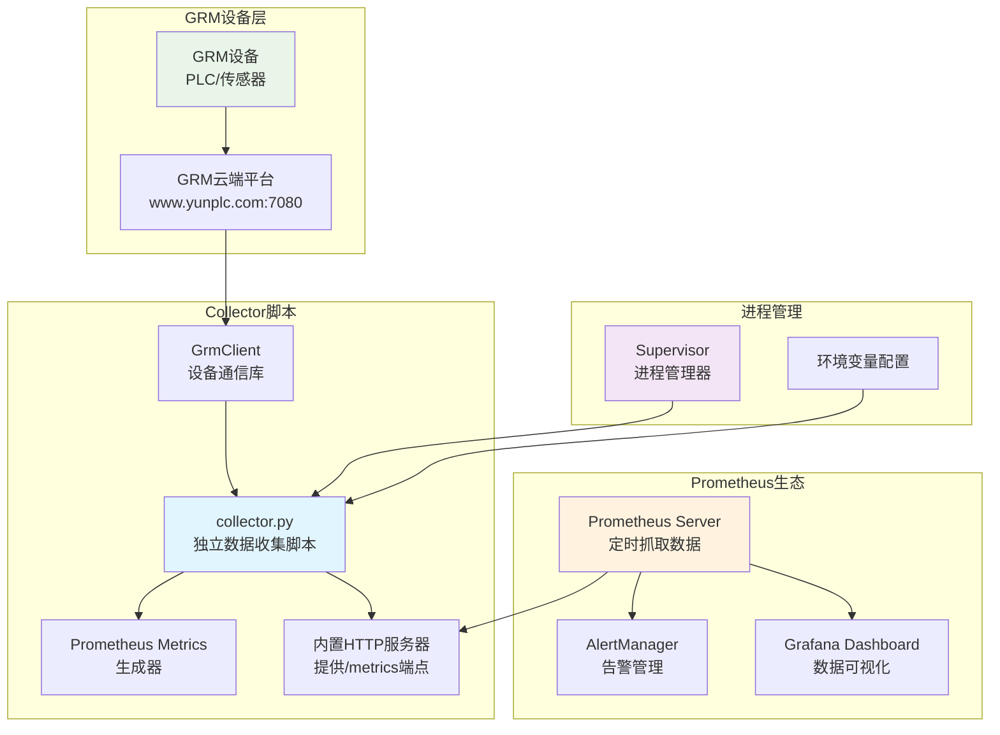
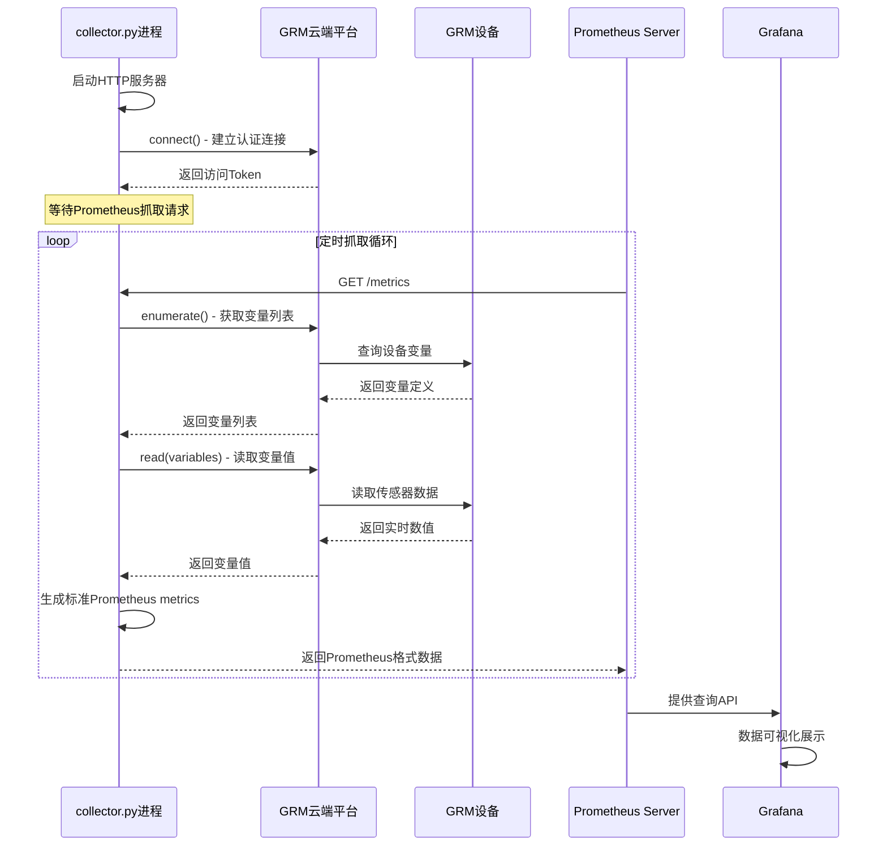

# HeTu Backend GRM数据采集器文档

## 📋 文档概述

**模块**: GRM设备数据采集器
**实现文件**: `apps/scada/script/collector.py`
**版本**: v1.0.0
**更新时间**: 2025-10-17
**文档目的**: 记录GRM数据采集器的设计和实现，为Prometheus监控集成和设备数据采集提供技术参考

---

## 🎯 核心作用

`apps/scada/script/collector.py` 是一个**独立的GRM平台数据收集脚本**，专门负责从GRM工业设备采集传感器数据并生成标准的Prometheus metrics。该脚本作为独立的HTTP服务器运行，提供`/metrics`端点供Prometheus Server抓取数据，是监控系统的核心数据源。

---

## 🔄 主要功能

### 1. **GRM设备通信**
- 建立与GRM云端平台的HTTP连接
- 处理设备认证和Token管理
- 实现设备连接的重试和错误处理

### 2. **数据采集处理**
- 通过`enumerate()`获取设备变量列表
- 使用`read()`批量读取所有变量值
- 处理读取错误和异常状态

### 3. **标准Prometheus Metrics生成**
- 将GRM数据转换为标准的Prometheus Gauge格式
- 生成符合Prometheus规范的指标标签和元数据
- 提供完整的`/metrics` HTTP端点

### 4. **独立HTTP服务器**
- 内置WSGI HTTP服务器，无需额外依赖
- 动态端口分配，避免端口冲突
- 支持多实例并发部署

---

## 🏗️ 架构设计

### 整体架构图



### 数据流转图



---

## 📝 核心实现分析

### 1. **GrmCollector类** - 核心数据收集器

```python
class GrmCollector(Collector):
    """
    GRM设备数据收集器，实现Prometheus Collector接口
    负责从GRM设备采集数据并生成标准Prometheus metrics
    """
    def __init__(self, module_number, module_secret, module_url):
        self._client = GrmClient(module_number, module_secret, module_url)
        try:
            self._client.connect()  # 建立GRM设备连接
        except GrmError as e:
            logger.error(f"登陆GRM模块错误 {e.message}")

    def collect(self):
        """
        Prometheus数据采集接口
        每次被Prometheus Server调用时执行完整的数据采集流程
        """
        try:
            # 1. 获取设备所有变量定义
            vars = self._client.enumerate()
            # 2. 批量读取所有变量当前值
            self._client.read(vars)
        except GrmError as e:
            logger.error(f"读取GRM模块数据错误 {e.message}")
            raise StopIteration() from e

        # 3. 构建标准Prometheus Gauge指标
        g = GaugeMetricFamily(
            f"grm_{self._client.token.id}_gauge",
            "GRM设备传感器数据",
            labels=["name", "type", "local"],
        )

        # 4. 遍历所有变量，生成指标数据
        for v in vars:
            if v.read_error == 0:
                # 成功读取的变量生成指标
                g.add_metric(
                    labels=[v.name, v.type, "false"],
                    value=v.value
                )
            else:
                # 记录读取错误
                logger.error(f"ERROR: {v.read_error}, Variable: {v.name}")
        yield g
```

### 2. **独立HTTP服务器实现**

```python
def cli(random_port, host, advertise, module_number, module_secret, module_url):
    """
    collector.py主函数 - 启动独立的数据收集服务
    包含HTTP服务器启动、端口分配、信号处理等核心功能
    """
    start_port = random_port
    end_port = random_port + 1000

    for _ in range(0, 3):  # 最多尝试3次端口分配
        try:
            # 1. 随机选择可用端口
            port = random.randint(start_port, end_port)

            # 2. 创建Prometheus WSGI应用
            registry = CollectorRegistry()
            registry.register(GrmCollector(module_number, module_secret, module_url))
            app = make_wsgi_app(registry)

            # 3. 启动内置HTTP服务器
            httpd = make_server(host, port, app, handler_class=CollectorHandler)

            # 4. 在后台线程运行HTTP服务器
            t = threading.Thread(target=httpd.serve_forever)
            t.daemon = True
            t.start()

            # 5. 输出服务地址标记 (供进程管理器获取)
            logger.info(f"# ADVERTISE {advertise}:{port}")

            # 6. 注册优雅停止信号处理
            def signal_handler(signal, frame):
                logger.info("Received SIGTERM. Cleaning up...")
                sys.exit(0)

            signal.signal(signal.SIGTERM, signal_handler)
            signal.pause()  # 阻塞主线程，等待信号

        except OSError as e:
            logger.error(f"Failed to start server on {host}:{port}: {e}")
```

### 3. **分级日志系统设计**

```python
# collector.py采用分级日志输出策略
# INFO级别输出到stdout - 便于进程管理器获取服务状态
# ERROR级别输出到stderr - 便于错误监控和调试

# 配置根日志记录器
logger = logging.getLogger(__name__)
logger.setLevel(logging.DEBUG)

# 错误日志处理器 - 输出到stderr
server_handler = logging.StreamHandler(stream=sys.stderr)
server_handler.setLevel(logging.ERROR)
logger.addHandler(server_handler)

# 信息日志过滤器 - 仅允许INFO级别通过
class InfoFilter(logging.Filter):
    def filter(self, record):
        return record.levelno == logging.INFO

# 信息日志处理器 - 输出到stdout
info_handler = logging.StreamHandler(stream=sys.stdout)
info_handler.setLevel(logging.INFO)
info_handler.addFilter(InfoFilter())
logger.addHandler(info_handler)

# 这样设计的好处：
# - stdout: 服务启动状态、ADVERTISE地址等正常信息
# - stderr: 连接错误、读取失败等异常信息
# - 便于容器化和进程管理器的日志收集
```

---

## 📊 标准Prometheus Metrics格式

### 指标命名规则

```
# 指标名称格式: grm_{module_id}_gauge
# - module_id: GRM设备的唯一标识符
# - gauge: 表示瞬时值的指标类型

# 完整指标格式示例:
grm_12345_gauge{name="temperature", type="F", local="false"} 25.6
grm_12345_gauge{name="pressure", type="F", local="false"} 101.3
grm_12345_gauge{name="pump_status", type="B", local="false"} 1.0
```

### 指标标签设计

| 标签 | 类型 | 说明 | 示例 |
|------|------|------|------|
| `name` | string | 设备变量名称 | `temperature`, `pressure`, `flow_rate` |
| `type` | string | 数据类型标识 | `F`(浮点), `I`(整数), `B`(布尔) |
| `local` | string | 变量来源标识 | `false`(设备变量), `true`(本地变量) |

### 指标生成逻辑

```python
# 在GrmCollector.collect()方法中生成的指标格式
g = GaugeMetricFamily(
    f"grm_{self._client.token.id}_gauge",  # 动态指标名称
    "GRM设备传感器数据",                     # HELP文本
    labels=["name", "type", "local"],       # 标签定义
)

# 每个变量生成一个时间序列数据点
for v in vars:
    if v.read_error == 0:
        g.add_metric(
            labels=[v.name, v.type, "false"],  # 标签值
            value=float(v.value)                 # 指标数值
        )
```

### Prometheus查询示例

```promql
# 查询特定设备的温度数据
grm_12345_gauge{name="temperature"}

# 查询所有设备的压力数据
grm_*_gauge{name="pressure"}

# 按数据类型分组查询
sum by (type) (grm_*_gauge)

# 计算平均值
avg(grm_*_gauge{name="temperature"})
```

---

## 🎛️ 配置参数

| 参数 | 类型 | 必需 | 默认值 | 说明 | 环境变量 |
|------|------|------|--------|------|----------|
| `random_port` | int | ✅ | - | 随机端口起始值 | `RANDOM_PORT` |
| `host` | str | ❌ | 127.0.0.1 | 绑定地址 | `HOST` |
| `advertise` | str | ❌ | 127.0.0.1 | 广告地址 | `ADVERTISE` |
| `module_number` | str | ✅ | - | GRM模块编号 | `MODULE_NUMBER` |
| `module_secret` | str | ✅ | - | GRM模块密钥 | `MODULE_SECRET` |
| `module_url` | str | ✅ | - | GRM云端URL | `MODULE_URL` |

---

## ⚡ 技术特点

### 优势
1. **标准化接口** - 使用Prometheus标准格式
2. **自动端口分配** - 避免端口冲突问题
3. **进程管理友好** - 支持Supervisor管理
4. **错误处理完善** - 详细的日志和异常处理
5. **轻量级实现** - 单进程，资源占用低

### 技术栈
- **HTTP服务器**: WSGI + wsgiref.simple_server
- **Prometheus客户端**: prometheus_client库
- **设备通信**: GrmClient (自定义HTTP客户端)
- **进程管理**: Python threading + signal处理

### 性能特征
- **响应时间**: < 100ms (不含网络延迟)
- **并发支持**: 单线程，支持多个Prometheus抓取
- **内存占用**: < 50MB
- **CPU占用**: < 5% (空闲时)

---

## 🔧 部署和运行

### 启动命令

```bash
python apps/scada/script/collector.py \
  --random-port 9000 \
  --host 0.0.0.0 \
  --advertise 192.168.1.100 \
  --module-number 12345 \
  --module-secret your_secret_key \
  --module-url http://www.yunplc.com:7080
```

### Supervisor配置

```ini
[program:grm-collector]
command=python apps/scada/script/collector.py
environment=RANDOM_PORT=9000,HOST=0.0.0.0,MODULE_NUMBER=12345,MODULE_SECRET=your_secret_key,MODULE_URL=http://www.yunplc.com:7080
directory=/Users/huayuan/Workspace/Hetu_legacy/backend
autostart=true
autorestart=true
stdout_logfile=/var/log/grm-collector.log
stderr_logfile=/var/log/grm-collector.err
```

### Docker部署

```dockerfile
FROM python:3.11
WORKDIR /app
COPY requirements.txt .
RUN pip install -r requirements.txt
COPY . .

CMD ["python", "apps/scada/script/collector.py"]
```

```yaml
# docker-compose.yml
version: '3.8'
services:
  grm-collector:
    build: .
    environment:
      - RANDOM_PORT=9000
      - HOST=0.0.0.0
      - MODULE_NUMBER=12345
      - MODULE_SECRET=your_secret_key
      - MODULE_URL=http://www.yunplc.com:7080
    ports:
      - "9000-10000:9000-10000"
```

---

## 📈 监控集成

### Prometheus配置

```yaml
# prometheus.yml
scrape_configs:
  - job_name: 'grm-devices'
    static_configs:
      - targets: ['192.168.1.100:9123', '192.168.1.101:9456']
    scrape_interval: 15s
    metrics_path: /metrics
    honor_labels: true
```

### Grafana Dashboard示例

```json
{
  "dashboard": {
    "title": "GRM设备监控",
    "panels": [
      {
        "title": "温度监控",
        "type": "graph",
        "targets": [
          {
            "expr": "grm_12345_gauge{name=\"temperature\"}",
            "legendFormat": "温度"
          }
        ]
      }
    ]
  }
}
```

### 告警规则

```yaml
# alert_rules.yml
groups:
  - name: grm_alerts
    rules:
      - alert: HighTemperature
        expr: grm_12345_gauge{name="temperature"} > 80
        for: 5m
        labels:
          severity: warning
        annotations:
          summary: "温度过高告警"
          description: "设备12345温度超过80度"
```

---

## 🔍 故障排查

### 常见问题

#### 1. **端口启动失败**
```
Failed to start server on 127.0.0.1:9123: [Errno 98] Address already in use
```
**解决方案**:
- 调整`random_port`参数范围
- 检查端口占用情况
- 增加重试次数

#### 2. **GRM连接失败**
```
登陆GRM模块错误 Connection timeout
```
**解决方案**:
- 检查网络连接
- 验证模块编号和密钥
- 确认GRM云端服务状态

#### 3. **数据采集异常**
```
读取GRM模块数据错误 Invalid response
```
**解决方案**:
- 检查GRM设备状态
- 验证变量配置
- 查看详细错误日志

### 调试技巧

1. **查看启动日志**
```bash
tail -f /var/log/grm-collector.log | grep "ADVERTISE"
```

2. **测试指标接口**
```bash
curl http://localhost:9123/metrics
```

3. **检查进程状态**
```bash
supervisorctl status grm-collector
```

---

## 💡 优化建议

### 短期优化
1. **并发采集** - 使用异步IO提升采集效率
2. **缓存机制** - 减少重复的变量枚举请求
3. **健康检查** - 添加服务健康状态端点
4. **指标丰富** - 增加连接状态、错误率等指标

### 长期规划
1. **多设备支持** - 一个进程服务多个GRM模块
2. **边缘计算** - 在采集器端进行数据预处理
3. **安全增强** - 添加TLS加密和认证机制
4. **云原生** - 支持Kubernetes部署和服务发现

### 性能优化方案

```python
# 异步采集示例
import asyncio
import aiohttp

class AsyncGrmCollector:
    async def collect_async(self):
        async with aiohttp.ClientSession() as session:
            # 并发读取多个变量
            tasks = [self.read_variable(var) for var in self.variables]
            results = await asyncio.gather(*tasks)
            return results
```

---

## 📚 相关文档

- [HeTu Backend 监控系统架构](./monitoring-system.md)
- [MQTT桥接服务文档](./mqtt-bridge.md)
- [GRM设备集成文档](../development/grm-integration.md)
- [Prometheus配置指南](../deployment/prometheus-setup.md)

---

## 📝 维护说明

### 监控指标
- 服务运行状态和端口
- 数据采集成功率
- 错误日志统计
- HTTP请求响应时间

### 维护任务
- 定期检查采集器状态
- 监控端口资源使用
- 更新GRM设备配置
- 备份关键配置文件

### 版本升级
1. 停止现有采集器进程
2. 备份配置文件
3. 部署新版本代码
4. 验证功能正常
5. 重启采集器服务

---

**文档维护**: 开发团队
**最后更新**: 2025-10-17
**版本**: v1.0.0