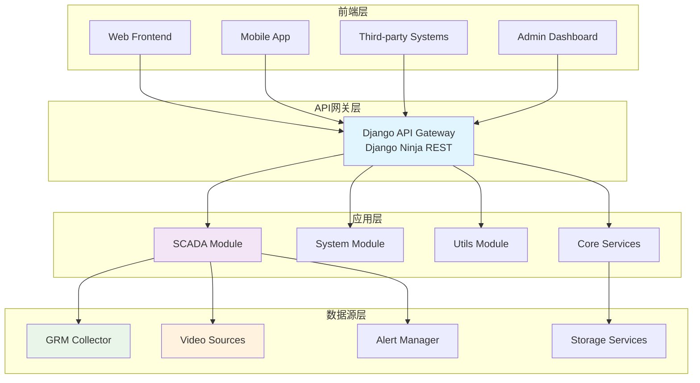
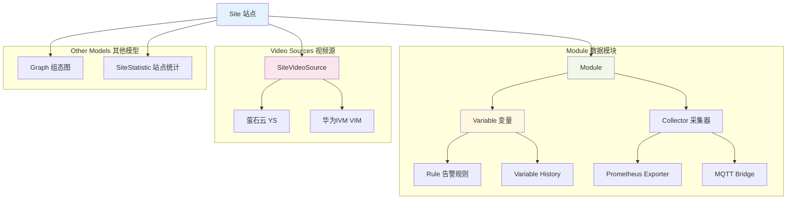
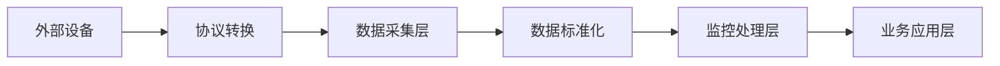
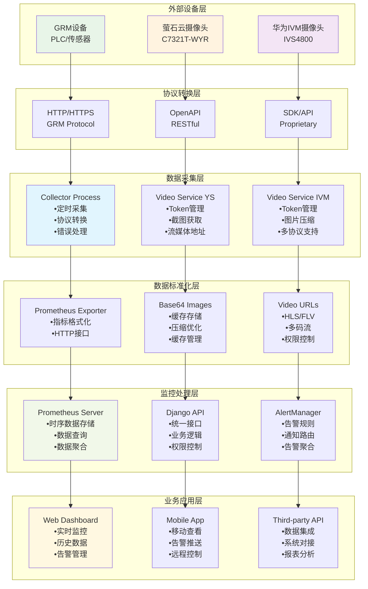
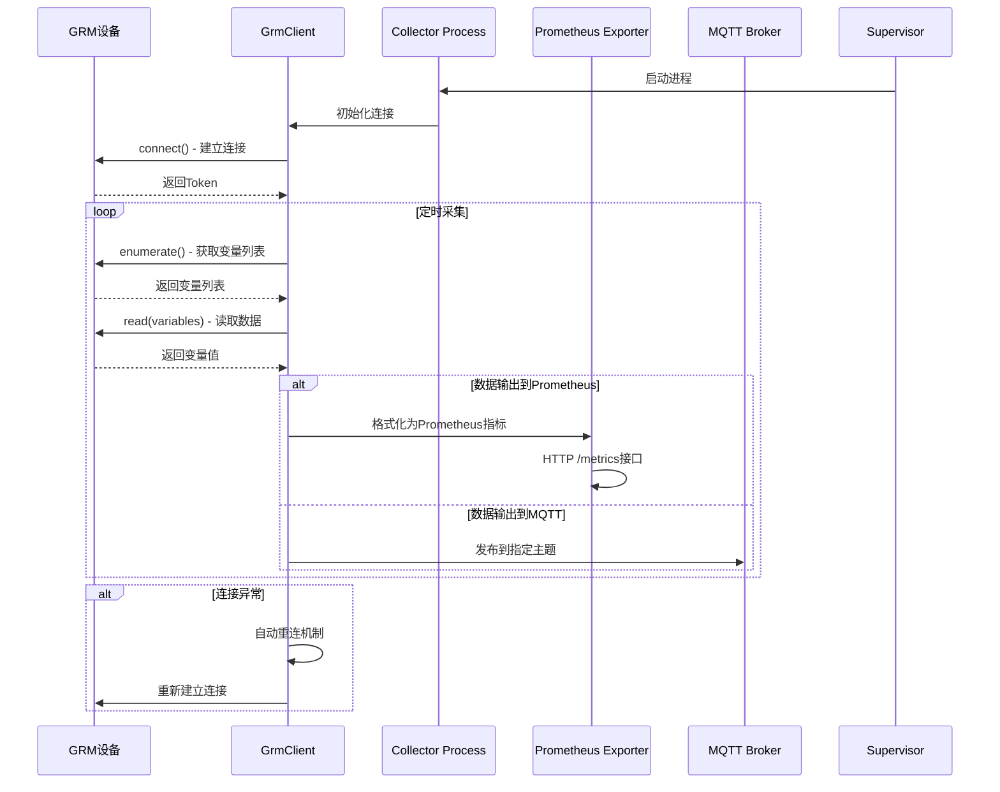
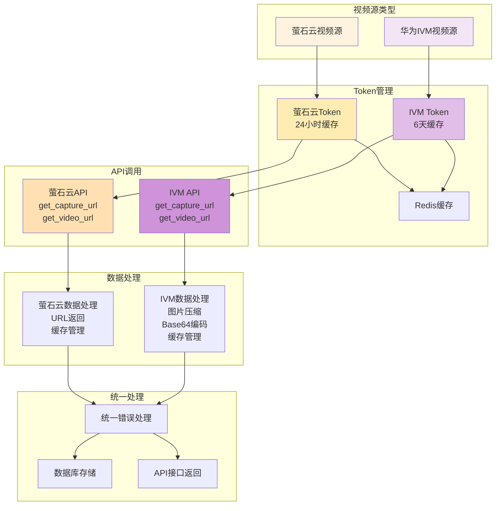
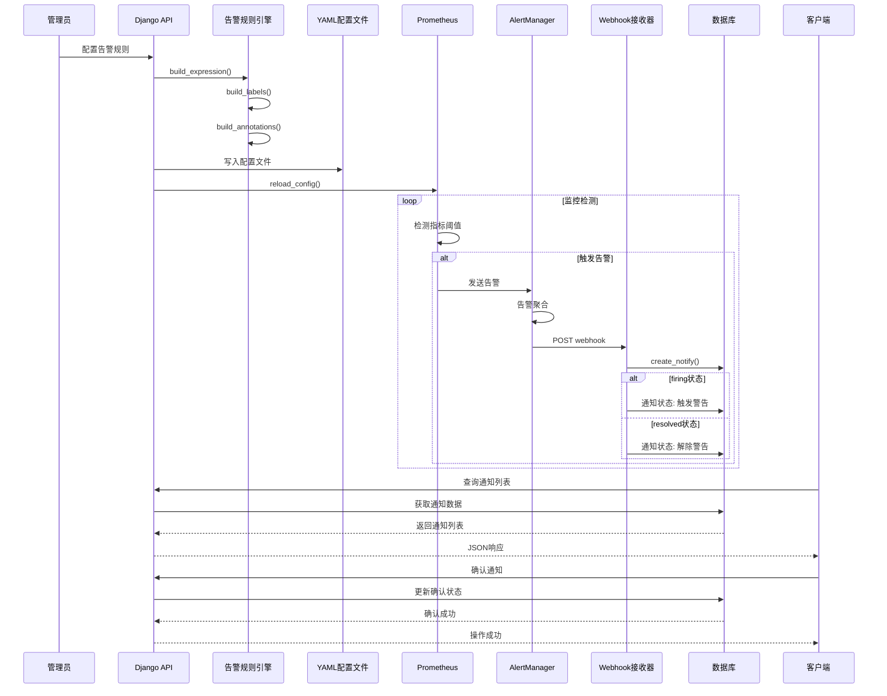

# HeTu Backend 监控系统架构文档

## 📋 文档概述

**项目**: 养殖污水处理智慧运营平台后端API
**版本**: v1.0.0
**更新时间**: 2025-10-17
**文档目的**: 记录监控系统架构设计，为后期优化和新数据源扩展提供指导

---

## 🏗️ 系统架构概览

### 整体架构图



### 核心设计原则

1. **模块化**: 清晰的功能边界，便于维护和扩展
2. **标准化**: 使用业界标准协议和数据格式
3. **高可用**: 进程管理、故障恢复、数据持久化
4. **可扩展**: 插件化数据源，支持多种协议
5. **安全性**: RBAC权限控制，数据加密传输

---

## 📊 数据源架构

### 数据源分类

| 数据源类型 | 协议/技术 | 用途 | 实现文件 |
|-----------|-----------|------|----------|
| **GRM设备** | HTTP/TCP | PLC/传感器数据采集 | `script/collector.py`, `utils/grm/` |
| **萤石云视频** | OpenAPI | 视频监控/截图 | `utils/ys.py` |
| **华为IVM** | SDK/API | 工业视频监控 | `utils/ivm.py` |
| **MQTT消息** | MQTT | 设备通信/数据同步 | `script/mqtt.py` |
| **告警系统** | Webhook | 监控告警通知 | `view/alert.py` |

### 数据模型层次结构



---

## 🔄 数据流架构

### 数据采集流程



#### 详细流程图



### 核心数据流

#### 1. GRM设备数据采集流程



**实现文件**: `apps/scada/script/collector.py`, `apps/scada/utils/grm/client.py`

#### 2. 视频监控数据流



#### 3. 告警数据流



---

## 🔧 核心组件设计

### 1. GRM数据采集器

**实现位置**: `apps/scada/script/collector.py`

**核心类**: `GrmCollector`

**关键特性**:
- 定时数据采集 (可配置间隔)
- Prometheus指标格式化
- 自动端口分配和随机端口启动
- Supervisor进程管理集成
- 错误重连机制

**输出格式**:
```
grm_{module_id}_gauge{name="variable_name", type="variable_type", local="false"} value
```

### 2. MQTT数据桥接器

**实现位置**: `apps/scada/script/mqtt.py`

**核心类**: `GrmMqttService`

**关键特性**:
- 双向通信支持 (读/写)
- 动态订阅管理
- 设备写入控制
- 错误处理和重连
- 可配置采集频率

**主题格式**:
```
数据发布: hetu/datasource/freq_{freq}/module_{module_id}/{group}/{variable_name}
命令接收: hetu/datasource/command/module_{module_id}/{group}/{variable_name}
```

### 3. 视频服务管理器

**萤石云集成**: `apps/scada/utils/ys.py`
**华为IVM集成**: `apps/scada/utils/ivm.py`

**关键特性**:
- Token缓存管理
- 图片压缩优化
- 多协议支持
- 统一错误处理
- Redis缓存集成

### 4. 告警规则引擎

**实现位置**: `apps/scada/view/alert.py`

**关键特性**:
- 动态规则配置
- YAML热更新
- 文件锁一致性
- 多种告警类型支持
- 通知状态管理

**规则类型**:
- `hight_limit`: 高限告警
- `low_limit`: 低限告警
- `binary_state`: 状态告警

---

## 🔌 数据源扩展机制

### 扩展接口设计

#### 1. 数据采集器接口

```python
# 基础接口定义
class DataSourceCollector:
    """数据源采集器基类"""

    def connect(self) -> bool:
        """建立连接"""
        pass

    def enumerate_variables(self) -> List[Variable]:
        """枚举可用变量"""
        pass

    def read_data(self, variables: List[Variable]) -> Dict[str, Any]:
        """读取数据"""
        pass

    def write_data(self, variables: List[Variable], values: Dict[str, Any]) -> bool:
        """写入数据"""
        pass

    def get_metrics(self) -> str:
        """获取Prometheus格式指标"""
        pass
```

#### 2. 视频源接口

```python
# 视频源基类
class VideoSourceManager:
    """视频源管理器基类"""

    def get_access_token(self) -> str:
        """获取访问令牌"""
        pass

    def get_capture_url(self, device_id: str, channel_id: str) -> str:
        """获取截图URL"""
        pass

    def get_video_url(self, device_id: str, channel_id: str) -> str:
        """获取视频URL"""
        pass

    def compress_image(self, image_data: str, quality: int) -> str:
        """压缩图片"""
        pass
```

#### 3. 告警处理器接口

```python
# 告警处理器基类
class AlertProcessor:
    """告警处理器基类"""

    def build_expression(self, rule: Rule) -> str:
        """构建告警表达式"""
        pass

    def build_labels(self, rule: Rule) -> Dict[str, str]:
        """构建告警标签"""
        pass

    def build_annotations(self, rule: Rule) -> Dict[str, Any]:
        """构建告警注解"""
        pass

    def process_webhook(self, payload: Dict[str, Any]) -> bool:
        """处理Webhook通知"""
        pass
```

### 新数据源接入流程

```mermaid
flowchart TD
    subgraph "步骤1: 创建数据源模块"
        CMD[创建目录结构<br/>mkdir -p apps/scada/utils/new_datasource]
        FILES[创建必要文件<br/>__init__.py, client.py, schemas.py, config.py]
    end

    subgraph "步骤2: 实现数据源客户端"
        CLIENT[实现NewDatasourceClient类]
        METHODS[实现核心方法<br/>connect(), enumerate_variables()<br/>read_data(), get_metrics()]
    end

    subgraph "步骤3: 集成到现有系统"
        MODEL[数据模型扩展<br/>apps/scada/models.py]
        APIVIEW[API接口扩展<br/>apps/scada/view/]
        SCRIPT[脚本集成<br/>apps/scada/script/]
        CONFIG[配置更新<br/>Django设置和环境变量]
    end

    subgraph "步骤4: 注册数据源"
        REGISTRY[注册到DATASOURCE_REGISTRY<br/>添加到数据源注册表]
        TEST[测试验证<br/>单元测试和集成测试]
    end

    CMD --> FILES
    FILES --> CLIENT
    CLIENT --> METHODS
    METHODS --> MODEL
    MODEL --> APIVIEW
    APIVIEW --> SCRIPT
    SCRIPT --> CONFIG
    CONFIG --> REGISTRY
    REGISTRY --> TEST

    style CMD fill:#e8f5e8
    style CLIENT fill:#e3f2fd
    style MODEL fill:#fff3e0
    style REGISTRY fill:#f3e5f5
    style TEST fill:#ffebee
```

#### 步骤1: 创建数据源模块

```bash
# 在 apps/scada/utils/ 下创建新的数据源目录
mkdir -p apps/scada/utils/new_datasource
cd apps/scada/utils/new_datasource

# 创建必要文件
touch __init__.py
touch client.py      # 数据源客户端
touch schemas.py     # 数据模型定义
touch config.py      # 配置管理
```

#### 步骤2: 实现数据源客户端

```python
# apps/scada/utils/new_datasource/client.py
from typing import List, Dict, Any
from apps.scada.utils.grm.schemas import GrmVariable

class NewDatasourceClient:
    """新数据源客户端实现"""

    def __init__(self, config: Dict[str, Any]):
        self.config = config
        self.connection = None

    def connect(self) -> bool:
        """实现连接逻辑"""
        # TODO: 实现具体的连接逻辑
        pass

    def enumerate_variables(self) -> List[GrmVariable]:
        """枚举变量"""
        # TODO: 实现变量枚举逻辑
        pass

    def read_data(self, variables: List[GrmVariable]) -> None:
        """读取数据"""
        # TODO: 实现数据读取逻辑
        pass
```

#### 步骤3: 集成到现有系统

1. **数据模型扩展**: 在 `apps/scada/models.py` 中添加相关模型
2. **API接口扩展**: 在 `apps/scada/view/` 中添加对应的API接口
3. **脚本集成**: 在 `apps/scada/script/` 中添加采集脚本
4. **配置更新**: 更新Django设置和环境变量

#### 步骤4: 注册数据源

```python
# 在适当的地方注册新数据源
DATASOURCE_REGISTRY = {
    'grm': GrmClient,
    'new_datasource': NewDatasourceClient,
    # 添加更多数据源...
}
```

### 配置管理

#### 数据源配置格式

```yaml
# config/datasources.yml
datasources:
  grm:
    enabled: true
    default_timeout: 5
    reconnect_attempts: 3

  mqtt:
    enabled: true
    broker: "localhost"
    port: 1883

  video_sources:
    ys:
      enabled: true
      cache_time: 86400  # 24小时

    ivm:
      enabled: true
      cache_time: 518400  # 6天

  new_datasource:
    enabled: false
    config:
      endpoint: "http://example.com"
      api_key: "your_api_key"
```

---

## 📈 性能优化建议

### 1. 数据采集优化

#### 当前瓶颈
- 单线程顺序读取变量
- 网络延迟影响采集效率
- 大量变量时的性能问题

#### 优化方案
```python
# 并发采集优化
import asyncio
import aiohttp

class AsyncGrmClient:
    """异步GRM客户端"""

    async def read_variables_async(self, variables: List[GrmVariable]) -> None:
        """并发读取变量"""
        # 分批处理，避免过载
        batch_size = 10
        for i in range(0, len(variables), batch_size):
            batch = variables[i:i + batch_size]
            tasks = [self.read_single_variable(var) for var in batch]
            results = await asyncio.gather(*tasks)
            # 处理结果...
```

### 2. 缓存策略优化

#### Redis缓存层次
```
L1缓存: 内存缓存 (1秒) - 实时数据
L2缓存: Redis缓存 (5分钟) - 历史数据
L3缓存: 数据库 - 持久化数据
```

#### 缓存键设计
```python
# 缓存键命名规范
CACHE_KEYS = {
    'grm_data': 'grm:{module_id}:{variable_name}',
    'video_capture': 'video:capture:{source}:{device_id}:{channel_id}',
    'video_stream': 'video:stream:{source}:{device_id}:{channel_id}',
    'alert_rules': 'alert:rules:{site_id}',
}
```

### 3. 数据库优化

#### 索引优化
```sql
-- 为常用查询添加索引
CREATE INDEX idx_variable_module_name ON scada_variable(module_id, name);
CREATE INDEX idx_notify_external_id ON scada_notify(external_id);
CREATE INDEX idx_rule_variable ON scada_rule(variable_id);
CREATE INDEX idx_notify_created_at ON scada_notify(created_at);
```

#### 数据分区
```python
# 按时间分区存储历史数据
class VariableHistory(models.Model):
    timestamp = models.DateTimeField(db_index=True)
    variable_id = models.IntegerField()
    value = models.FloatField()

    class Meta:
        # 按月分区
        partition_by = ('timestamp', 'monthly')
```

---

## 🚀 系统演进方向

### 短期优化 (1-3个月)

1. **异步采集改造**
   - 将同步采集改为异步
   - 提升数据采集效率
   - 减少资源占用

2. **监控系统增强**
   - 添加采集器健康检查
   - 实现数据质量监控
   - 增强告警规则引擎

3. **视频服务优化**
   - 支持更多视频协议
   - 实现视频流录制
   - 添加AI视频分析

### 中期规划 (3-6个月)

1. **微服务架构拆分**
   - 数据采集服务独立部署
   - 视频服务微服务化
   - 告警服务独立

2. **时序数据库升级**
   - 引入InfluxDB或TimescaleDB
   - 优化大数据量查询
   - 提供数据压缩和归档

3. **容器化部署**
   - Docker容器化
   - Kubernetes编排
   - 自动扩缩容

### 长期愿景 (6-12个月)

1. **边缘计算支持**
   - 边缘设备数据预处理
   - 边缘告警规则执行
   - 减少网络带宽需求

2. **AI/ML集成**
   - 异常检测算法
   - 预测性维护
   - 智能告警降噪

3. **云原生架构**
   - 完全云原生部署
   - 多租户支持
   - 全球分布式部署

---

## 🔒 安全性考虑

### 1. 认证授权
- JWT Token认证
- RBAC权限控制
- API访问频率限制

### 2. 数据安全
- 传输层加密 (HTTPS/TLS)
- 敏感数据加密存储
- 数据脱敏处理

### 3. 网络安全
- 防火墙规则配置
- VPN访问控制
- DDoS攻击防护

---

## 📚 相关文档

- [API接口文档](../api/)
- [部署指南](../deployment/)
- [运维手册](../operations/)
- [开发指南](../development/)

---

## 📝 维护说明

### 版本控制
- 使用语义化版本号 (SemVer)
- Git分支策略: main/develop/feature
- 代码审查流程

### 监控指标
- 系统性能指标
- 业务指标监控
- 错误率统计

### 备份策略
- 数据库定期备份
- 配置文件版本控制
- 日志文件归档

---

**文档维护**: 开发团队
**最后更新**: 2025-10-17
**版本**: v1.0.0