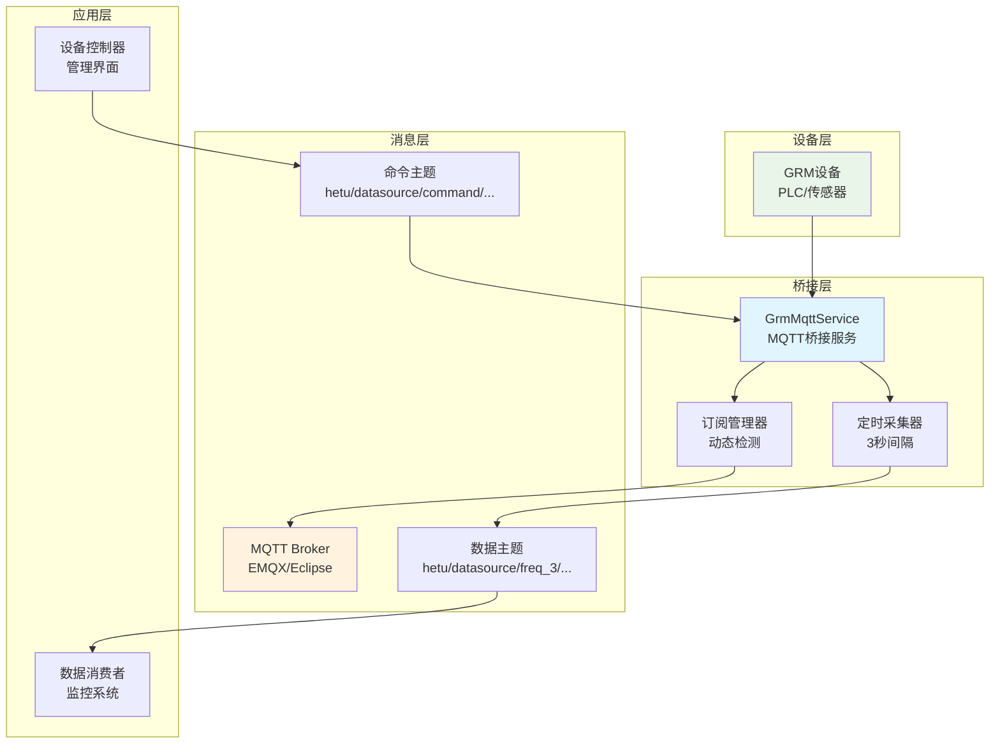
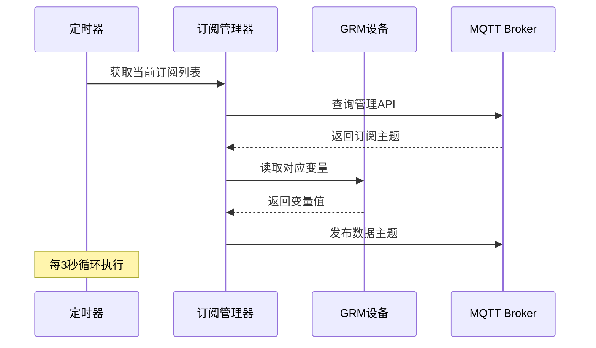
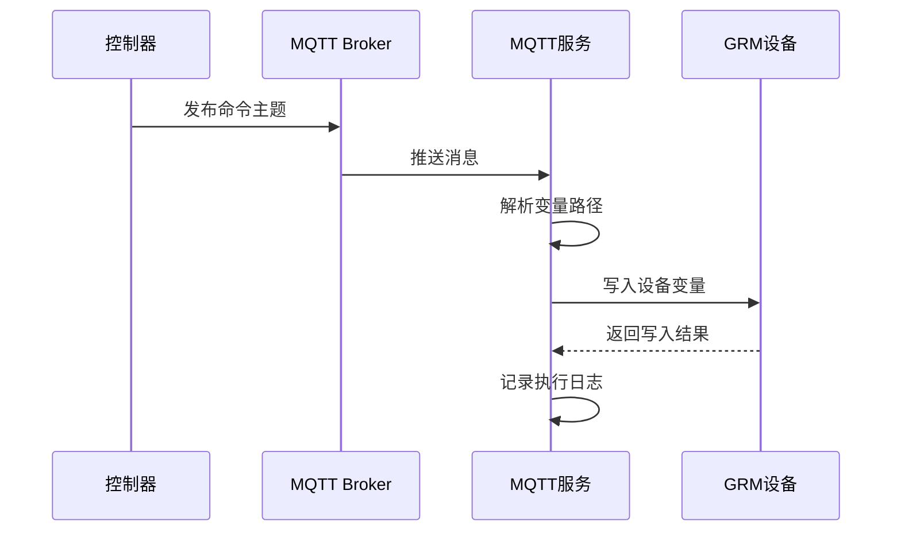

# HeTu Backend MQTT桥接服务文档

## 📋 文档概述

**模块**: GRM设备MQTT桥接服务
**实现文件**: `apps/scada/script/mqtt.py`
**版本**: v1.0.0
**更新时间**: 2025-10-17
**文档目的**: 记录MQTT桥接服务的设计和实现，为IoT集成和远程控制提供技术参考

---

## 🎯 核心作用

`apps/scada/script/mqtt.py` 是一个**GRM设备MQTT桥接服务**，实现传统工业设备与现代IoT消息队列之间的双向通信，是系统中唯一支持设备远程控制的数据通道。

---

## 🔄 主要功能

### 1. **数据上传 (GRM → MQTT)**
```
GRM设备 → 读取变量 → MQTT发布 → 上层系统消费
```

### 2. **指令下发 (MQTT → GRM)**
```
上层系统 → MQTT命令 → GRM写入 → 设备执行
```

### 3. **动态订阅管理**
- 根据MQTT Broker的订阅情况自动调整数据采集
- 支持按需数据传输，避免无效数据采集

---

## 🏗️ 架构设计

### 整体架构图



---

## 📝 核心实现分析

### 1. **数据采集循环** (`_read_and_publish`)

```python
def _read_and_publish(self):
    try:
        variables = self._get_subscriptions()  # 动态获取订阅
        if not variables:
            return
        self._grm.read(variables)             # 读取GRM数据

        for v in variables:
            if len(v.group) > 0:
                topic = f"{self._topic_root}{v.group}/{v.name}"
            else:
                topic = f"{self._topic_root}{v.name}"
            if v.read_error != 0:
                self._mqtt.publish(f"{topic}/error", v.read_error)
            else:
                self._mqtt.publish(topic, v.value)
    except Exception as e:
        logger.error(f"Error reading from GRM client or publishing to MQTT: {e}")
    finally:
        if self._running:
            self._start_timer()  # 重启定时器
```

### 2. **动态订阅检测** (`_get_subscriptions`)

- 查询MQTT Broker的管理API获取当前订阅列表
- 根据订阅的Topic智能解析需要采集的变量
- 支持 `module_x/variable_name` 和 `module_x/group/variable_name` 格式

```python
def _get_subscriptions(self) -> list[GrmVariable]:
    # 查询MQTT Broker管理API
    response = requests.get(self._manager_url, headers=headers, timeout=3)

    for result in data["data"]:
        topic = result["topic"]
        if topic.startswith(self._topic_root):
            variable_path = topic[len(self._topic_root):]
            # 解析变量路径并构建GrmVariable对象
```

### 3. **命令处理** (`_on_message`)

```python
def _on_message(self, client: mqtt.Client, userdata: Any, msg: mqtt.MQTTMessage):
    try:
        if msg.topic.startswith(self._command_root):
            value = float(msg.payload.decode())
            variable_path = msg.topic[len(self._command_root):]

            # 解析变量路径
            if "/" in variable_path:
                group, variable_name = variable_path.split("/")
            else:
                group = ""
                variable_name = variable_path

            # 构建GRM变量并写入设备
            grm_var = GrmVariable(
                module_number=self.module_number,
                name=variable_name,
                group=group,
                type="F",
                rw=True,
                value=value
            )
            self._grm.write([grm_var])
```

---

## 📡 数据流设计

### 数据上传流程 (GRM → MQTT)



### 指令下发流程 (MQTT → GRM)



---

## 🎛️ 配置参数

| 参数 | 默认值 | 说明 | 环境变量 |
|------|--------|------|----------|
| `broker` | localhost | MQTT服务器地址 | `BROKER` |
| `port` | 1883 | MQTT端口 | `PORT` |
| `manager_port` | 18083 | 管理API端口 | - |
| `manager_username` | - | 管理API用户名 | `MANAGER_USERNAME` |
| `manager_secret` | - | 管理API密钥 | `MANAGER_SECRET` |
| `module_number` | - | GRM模块编号 | `MODULE_NUMBER` |
| `module_secret` | - | GRM模块密钥 | `MODULE_SECRET` |
| `module_url` | http://www.yunplc.com:7080 | GRM云端地址 | `MODULE_URL` |
| `freq` | 3秒 | 采集频率 | `FREQ` |

---

## 📨 Topic设计

### 数据发布主题 (只读)
```
hetu/datasource/freq_{freq}/module_{module_id}/{group}/{variable_name}
```

**示例**:
- `hetu/datasource/freq_3/module_12345/temperature/room1`
- `hetu/datasource/freq_3/module_12345/pressure`

### 命令接收主题 (写入)
```
hetu/datasource/command/module_{module_id}/{group}/{variable_name}
```

**示例**:
- `hetu/datasource/command/module_12345/fan/speed`
- `hetu/datasource/command/module_12345/heater/power`

### 错误主题
```
hetu/datasource/freq_{freq}/module_{module_id}/{group}/{variable_name}/error
```

---

## ⚡ 技术特点

### 优势
1. **双向通信** - 支持数据上传和指令下发
2. **按需采集** - 根据订阅动态调整，避免资源浪费
3. **实时性好** - 3秒采集间隔，QoS=2保证消息可靠性
4. **易于集成** - 标准MQTT协议，兼容各种IoT平台
5. **设备控制** - 系统中唯一支持远程设备控制的数据通道

### 限制
1. **单设备服务** - 每个进程只服务一个GRM模块
2. **依赖外部Broker** - 需要额外的MQTT服务器
3. **简单协议** - 只支持数值型变量，不支持复杂数据类型
4. **部署复杂度** - 需要配置和维护MQTT Broker

---

## 🔍 当前使用状态分析

### 可能未使用的原因
1. **架构简化** - 直接使用Prometheus采集可能更简单
2. **部署复杂度** - 需要额外维护MQTT Broker
3. **需求不足** - 双向通信功能可能不是必需的
4. **技术栈重叠** - 与其他数据采集方案功能重复

### 潜在价值
1. **远程控制** - 唯一支持设备写入的通道
2. **实时性要求高** - 比HTTP轮询更高效
3. **IoT生态集成** - 便于与其他IoT系统集成
4. **边缘计算** - 适合在边缘节点部署

---

## 🚀 使用场景

### 推荐使用场景
- **需要远程设备控制** - 通过MQTT下发控制指令
- **与IoT平台集成** - 连接其他MQTT设备和系统
- **高实时性要求** - 需要3秒以内数据更新频率
- **边缘计算部署** - 在边缘节点处理数据

### 不推荐场景
- **简单的数据监控** - 使用collector.py更简单
- **单点部署** - 不想维护额外的MQTT Broker
- **纯数据采集** - 不需要设备控制功能

---

## 🔧 部署和运行

### 启动命令
```bash
python apps/scada/script/mqtt.py \
  --broker localhost \
  --port 1883 \
  --manager-username admin \
  --manager-secret secret \
  --module-number 12345 \
  --module-secret your_secret \
  --module-url http://www.yunplc.com:7080 \
  --freq 3
```

### Docker部署示例
```dockerfile
FROM python:3.11
COPY . /app
WORKDIR /app
RUN pip install -r requirements.txt

CMD ["python", "apps/scada/script/mqtt.py"]
```

### Supervisor配置
```ini
[program:mqtt-bridge]
command=python apps/scada/script/mqtt.py
environment=BROKER=localhost,MANAGER_USERNAME=admin,MANAGER_SECRET=secret
autostart=true
autorestart=true
```

---

## 💡 优化建议

### 短期优化
1. **支持多设备** - 一个进程服务多个GRM模块
2. **数据类型扩展** - 支持字符串、布尔等数据类型
3. **错误恢复** - 增强断线重连和错误处理机制
4. **监控指标** - 添加服务健康状态监控

### 长期规划
1. **与collector整合** - 统一数据采集架构
2. **云原生支持** - 支持Kubernetes部署
3. **安全增强** - 添加TLS加密和认证
4. **性能优化** - 支持异步IO和高并发

---

## 📚 相关文档

- [HeTu Backend 监控系统架构](./monitoring-system.md)
- [GRM设备集成文档](../development/grm-integration.md)
- [MQTT Broker配置指南](../deployment/mqtt-setup.md)
- [IoT平台集成方案](../integration/iot-platforms.md)

---

## 📝 维护说明

### 监控指标
- 服务运行状态
- 消息发布/接收速率
- 错误率和重连次数
- GRM设备连接状态

### 故障排查
1. **检查MQTT Broker连接** - 确认broker地址和端口
2. **验证GRM设备连接** - 检查模块编号和密钥
3. **查看服务日志** - 关注异常和错误信息
4. **检查Topic权限** - 确认发布和订阅权限

---

**文档维护**: 开发团队
**最后更新**: 2025-10-17
**版本**: v1.0.0